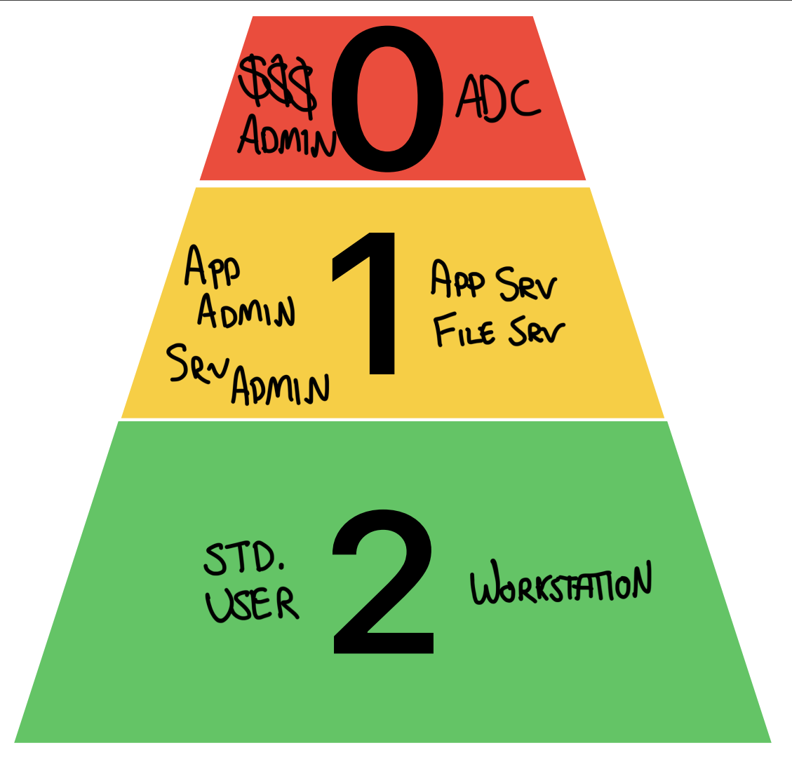
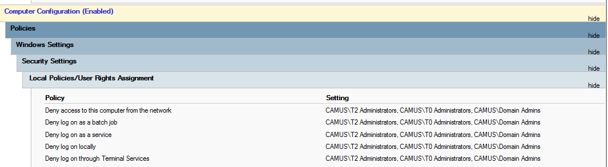
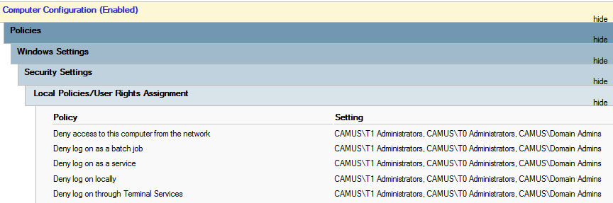
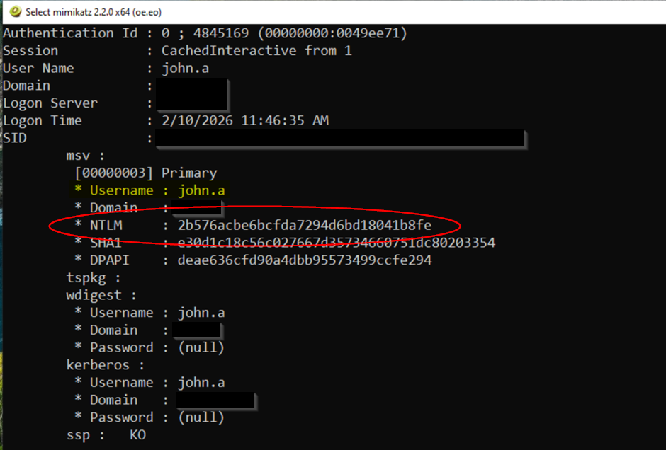
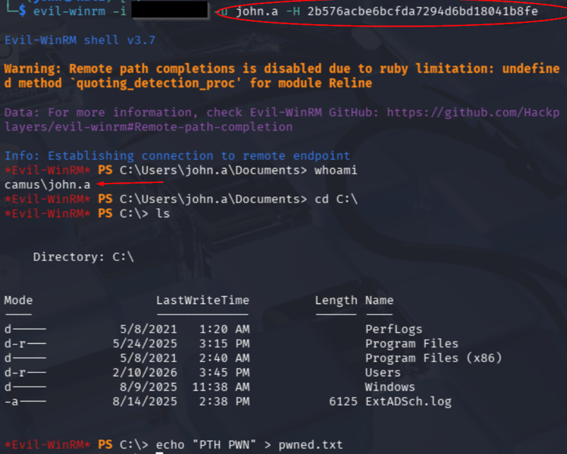

# Implement a Tiered AD Model


Don't lose your domain .

## What?
The tiered AD model is one that categorises assets based on criticality. Tiers are used to prevent attackers from moving vertically from easily exploitable assets to assets of criticality. Enforcement is achieved by preventing authentication across tiers (both upward and downward) except for strictly controlled administrative workflows.

## How?
### Segment Tiers
#### Tier 0: 
Tier 0 should consist of the most business critical and important assets. *SpectreOps* has a [guide](https://specterops.github.io/TierZeroTable/) to help identify what should go in tier 0. Common assets include:
- Domain Controllers
- Domain Administrators
#### Tier 1: 
Tier 1 typically consists of less critical business resources, including:
- Application servers
- File servers
- Application administrators
#### Tier 2: 
Tier 2 is where end-users and devices are placed. This includes:
- Standard user accounts
- Staff laptops
### Enforce Segregation of Tiers
#### GPO:
Configure the following location - *Computer Configuration > Windows Settings > Security Settings > Local Policies > User Rights Assignment*, and configure these settings:

> [!info]- GPO
> - Deny access to this computer from the network
> - Deny log on as a batch job
> - Deny log on as a service
> - Deny log on locally
> - Deny log on through Terminal Services

##### Tier 0 GPO:
- Deny Tier 1 and 2 users
##### Tier 1 GPO:
- Deny Tier 0 and 2 users

##### Tier 2 GPO:
- Deny Tier 0 and 1 users

## Why?
### Reduce the blast radius of a compromise
#### The scenario 
Imagine *Ringo*. He's the kind of guy who spam clicks his way through your company's cyber security awareness training, lest he receive an entourage of automated reminder emails. Ringo is high up in the company and has a short patience for computer issues. IT support (John) decided to give him local administrator on his laptop so he can resolve any issues as he needs (and install *work* related software). 

Ringo likes to browse sites such as Facebook and his personal email on his work computer. One day whilst in the office he suddenly gets a ping from his Gmail. It's an email from *Kayoe*. Free cricket. Ringo doesn't hesitate and downloads the video player (compromise!). 

Earlier that day John performed a manual fix on the laptop with their admin account (Domain Administrator). That's a problem. Now the credential material is stored in memory, and the attacker can re-use that material to authenticate to services with the highest administrative privilege (pass the hash).
## Pass the hash
### LSASS and NTLM
When a user authenticates, Windows creates a logon session in Local Security Authority Subsystem Service (LSASS) and maintains the appropriate credential material. LSASS keeps this material in memory, including NT Lan Manager (NTLM) . The NTLM hash is a secret derived from the user's password. NTLM treats the possession of this hash as proof of identity.
### In action
So back to our scenario, Ringo has local admin on his laptop and John has Domain Administrator. The attacker has already compromised the laptop and Ringo's account and has remote access. 

**Step 1**. They use a free tool called *mimikatz* to dump the credential material in memory from LSASS.

**Step 2**.  Simply pass the NTLM hash, and voila, domain administrator privileges.

